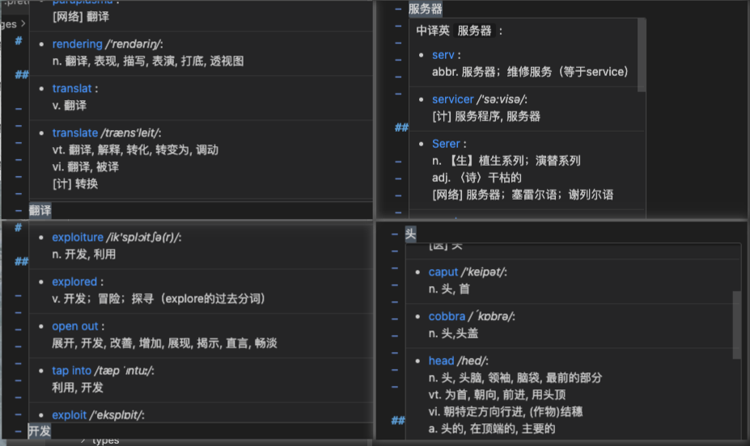

# Translate Dict for VS Code

## 简介

Translate Dict 是一款基于 Code Translate 的纯粹滑词翻译软件。

1. 无侵入式的显示翻译结果: 与 VS Code 代码分析完美结合

2. 强大的单词拆分能力:

   - 支持驼峰、帕斯卡、下划线、连字符等多种命名格式
   - 智能识别组合词（如 `audioinput` → `audio` + `input`）
   - 正确处理连续大写字母（如 `HTTPServer` → `HTTP` + `Server`）
   - 自动过滤单字母前缀（如 `IUser` → `User`）
   - 多种大小写变体匹配，支持缩写形式（如 `Ht` 匹配 `Ht.`）
   - 支持选中词组进行翻译

3. 丰富的本地词库: 包含 76 万+离线单词 (约 63.93 MB), 支持各种生僻单词, 单词来源：[ECDICT](https://github.com/skywind3000/ECDICT)

4. 基于丰富的本地词库: Translate Dict 拥有超快的查询速度, 每个单词在基本在 10ms 内可查询完毕

5. 多端支持: VS Code 桌面版 和 VS Code Online 版本, 插件均可支持

---

## 功能特性

### 双向翻译

- **英译中**: 鼠标悬停在英文单词上，自动显示中文翻译，响应极快
- **中译英**: 选中纯中文文本后悬停，根据匹配得分展示最佳的 10 个结果
  - 优先显示完全匹配和独立词匹配的结果（准确率肯定没有预期那么高的 🫣）
  - 由于需要遍历全部词库进行反向查询，中译英约需 160-200ms（仍然很快）

### 文件过滤

通过配置文件类型来控制翻译功能的作用范围：

- `translateDict.includeFileExtensions`: 启用翻译的文件后缀列表（为空则对所有文件生效）
  - 示例: `["js", "ts", "py"]`
- `translateDict.excludeFileExtensions`: 禁用翻译的文件后缀列表
  - 示例: `["md", "txt", "json"]`

### 中译英配置

- `translateDict.chineseToEnglishMaxResults`: 中译英最大显示结果数量，默认为 10，范围 1-50

### 全局开关

通过右键菜单快速启用/禁用翻译功能：

- 在编辑器中**右键** → **"Translate Dict"** → 选择 **"启用"** 或 **"禁用"**
- 或使用**命令面板** (Ctrl+Shift+P / Cmd+Shift+P)，搜索 **"Translate Dict"** 相关命令

这样可以在不需要翻译时快速关闭，避免干扰正常工作。

---

## TODO

- [x] 允许 ignore 文件 或者 include 文件
- [x] 添加全局开关快速启用/禁用翻译
- [x] 尝试拆分类似 audioinput 这种组合词
- [x] 中译英（通过本地词典反向查询）
- [ ] 自定义跳转翻译平台

## 预览

- 鼠标悬停翻译:
  
- 自动拆分组合词:
  
- 自由框选单词:
  
- 选中中文翻译:
  
- 跳转第三方查询
  

---

## License

[MIT licensed](LICENSE)

based on [Code Translate](https://github.com/w88975/code-translate-vscode)
